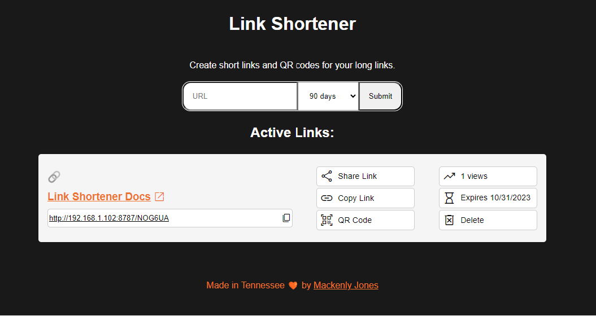
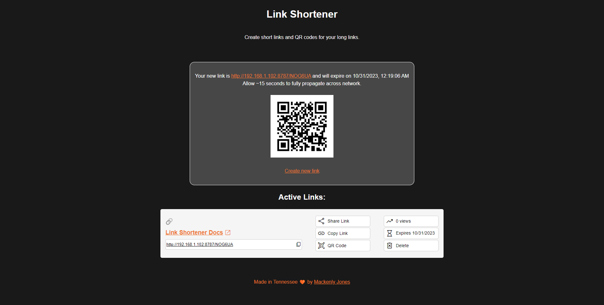

# link-shortener

Cloudflare Worker Based Link Shortener

## Features
- Self-hosted on Cloudflare Workers
- Easy to deploy
- Extremely low cost
- Customizable
- No database required (uses KV)
- Create links via dashboard or API
- Secured using Cloudflare Access Zero Trust
- Built in QR code generation
- Click counter for analytics
- Automatic link expiration (3 hours to 10 years)

## Getting Started
See documentation for the [getting started](https://linkshortener.dev/getting-started) guide.

### API Documentation
See [API Route Docs](https://linkshortener.dev/api-routes) for more information.

### Security
This tool is secured using Cloudflare Zero Trust's Access control tool. This allows you to easily integrate with your existing identity provider (IdP) to secure access to the dashboard and API. See the [zero trust setup](https://linkshortener.dev/zero-trust-setup) guide for more information.

## Development
- Clone the repo, change into the directory, install dependencies with `npm install`, change into the `link-shortener` directory, and run `npm run start` to start the development server.
- To run tests, run `npm run test`.
- To deploy using Wrangler, run `npm run deploy`.
- If adding new features, first create an issue to discuss the feature before submitting a PR. Please include tests for new features.

### TODO:
 - [ ] Provide hosted demo (limited to 30-second links)
 - [ ] Explore adding, integrating, or building an an analytics solution
 - [ ] Explore link landing pages confirming the URL users are visiting
 - [ ] Document [deployment process](https://github.com/mackenly/link-shortener/issues/7) and how to secure the app using [Zero Trust](https://github.com/mackenly/link-shortener/issues/6)

## License
This project is licensed under the GNU General Public License v3.0 - see the [LICENSE](LICENSE) file for details.