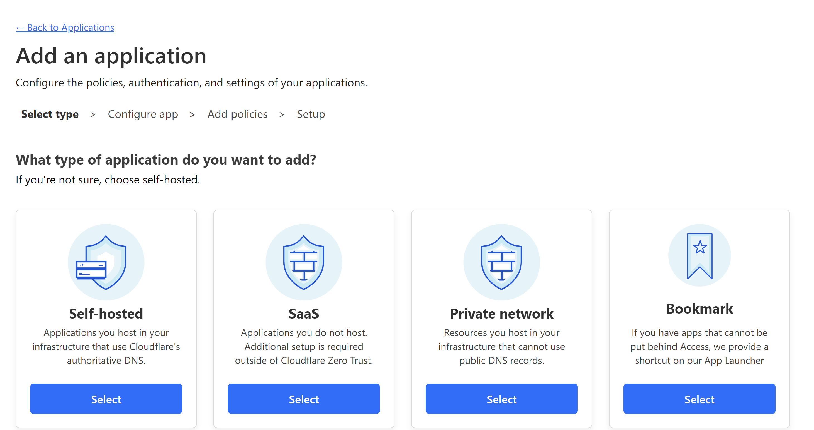
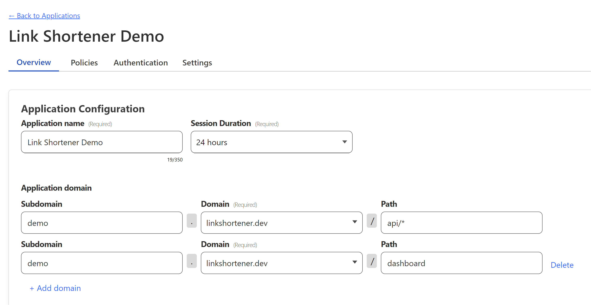

import { Callout } from 'nextra/components'

# Configure Zero Trust for Link Shortener
Link Shortener is easy to secure for you or your organization using Cloudflare Zero Trust.

## Setup Tutorial

Navigate to the `Applications` settings of your [Zero Trust account](https://one.dash.cloudflare.com/?to=/:account/access/apps).

Click `Add an Application` and select `Self Hosted` from the list of application types.

Now select the zone (apex domain) you linked to your Link Shortener instance. ([See getting started guide](./getting-started)).

If you used a subdomain, enter it into the subdomain field.

Now for the path enter `api/*` and repeat for `dashboard` as shown below.

<Callout type="error" emoji="❕">
    Alternative option: The above rule for the api blocks users from using the [external public route](./api-routes/public-routes). If you want anyone to be able to create links, you should use `api/links` instead which will block non-authorized users.
</Callout>

You can now continue through the application creation process and save the application.

<Callout type="info" emoji="❕">
    Make sure to create or select an access control policy to allow you or your desired users to access the application. There also has to be at least one authentication provider configured as well (you can start out with email codes).
</Callout>

## A few notes about security
- This tool is not multitenant, meaning that anyone with access to the links api route can see (and delete) all links created by all users.
- It's convievable that public routes could be used to create a link that redirects to a malicious site. This is why it's important to use Zero Trust to secure your instance and to understand the risks of using public routes.
- The API is not rate limited, so it's possible to create a lot of links in a short amount of time. It would take a lot to bring down Cloudflare, but it's very possible that you could end up with an expensive bill.
- This tool really isn't designed to be Bitly clone or a open source SaaS, it's a personal or company link shortener. If you want to use it for something else, you're welcome to, but understand the the ideal use case is for a single user or a small to mid sized team. With Cloudflare Workers and Zero Trust you probably won't have to worry about performance or security problems, but you may encounter things that don't fit your organization's needs. As a freelancer, [I am of course avaliable for customization or support](https://mackenly.com) to help you get the most out of Link Shortener.